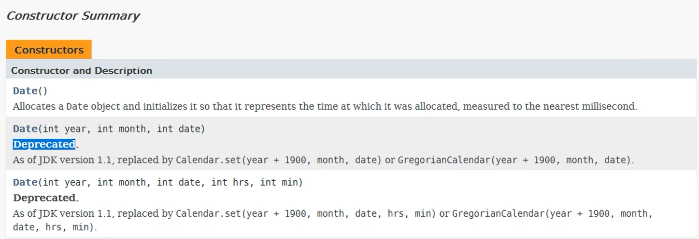

# 注解（Annotation）

Annotation其实就是代码里的**特殊标记**，这些标记可以在编译、类加载、运行时被读取，并执行相应的操作。

Annotation可以像修饰符一样呗使用，可用于**修饰包，类，构造器，方法，成员变量，参数，局部变量**的声明，这些信息被保存在Annotation的“name=value”中。

**框架 = 注解 + 反射 + 设计模式**

#### 常见的Annotation示例

1、示例一：生成文档相关的注解

@auther 标明开发该类模块的作者，多个作者之间使用,分割

@version 标明该类模块的版本

@see 参考转向，也就是相关主题

@since 从哪个版本开始增加的

@param 对方法中某参数的说明，如果没有参数就不能写

@return 对方法返回值的说明，如果方法的返回值类型是void就不能写

@exception 对方法坑你抛出的异常进行说明，如果方法没有用throws显式抛出的异常就不能写其中

```java
/**
 * @author wzy
 * @create 16:03
 */
public class AnnotationDemo {

    /**
     * 用户查询表中的一条记录
     *
     * @param sql  用于查询的SQL语句
     * @param args 用于填充占位符
     * @return  查询到的条目数
     */
    public int query(String sql,Object... args){
        return 0;
    }
}

```

2、示例二：在编译时进行格式检查（JDK内置的三个基本注解）

@Override : 限定重写父类方法，该注解只能用于方法

@Deprecated :用于表示所修饰的元素（类，方法等）已过时。通常是因为所修饰的结构危险或存在更好的选择

@SuppressWarnings : 抑制编译器警告

[示例代码](../src/test/java/com/atguigu/annotation/AnnotationDemoTest.java)

3、示例三：跟踪代码依赖性，实现代替配置文件功能

Servlet3.0提供了注解（annotation），使得不再需要在web.xml文件中进行Servlet的部署。

```java
@WebServlet
public class LoginServlet extends HttpServlet{
	private static final long serialVersionUID = 1L;
	protected void doGet(HttpServletRequest request,HttpServletResponse response) throws ServletException, IOException {}
	protected void (HttpServletRequest request,HttpServletResponse response) throws ServletException, IOException {
		doGet(request,response);
	}
}
```
替换xml相关内容

```xml
<servlet>
    <servlet-name>LoginServlet</servlet-name>
    <servlet-class>com.servlet.LoginServlet</servlet-class>
</servlet>
<servlet-mapping>
	<servlet-name>LoginServlet</servlet-name>
    <url-pattern>/login</url-pattern>
</servlet-mapping>
```


#### 自定义Annotation

定义新的Annotation类型使用@interface关键字

自定义注解自动继承了java.lang.annotation.Annotation接口

```java
package java.lang.annotation;

/**
 * Annotation retention policy.  The constants of this enumerated type
 * describe the various policies for retaining annotations.  They are used
 * in conjunction with the {@link Retention} meta-annotation type to specify
 * how long annotations are to be retained.
 *
 * @author  Joshua Bloch
 * @since 1.5
 */
public enum RetentionPolicy {
    /**
     * Annotations are to be discarded by the compiler.
     */
    SOURCE,

    /**
     * Annotations are to be recorded in the class file by the compiler
     * but need not be retained by the VM at run time.  This is the default
     * behavior.
     */
    CLASS,

    /**
     * Annotations are to be recorded in the class file by the compiler and
     * retained by the VM at run time, so they may be read reflectively.
     *
     * @see java.lang.reflect.AnnotatedElement
     */
    RUNTIME
}
```

Annotation的成员变量在 Annotation定义中以无参数方法的形式来声明。其方法名和返回值定义了该成员的名字和类型。称为配置参数。类型只能是**八种基本数据类型、String类型、Class类型、enum类型、Annotation类型**以上所有类型的数组。

可以在定义Annotation的成员变量时为期指定初始值，指定成员变量的初始值可使用**default关键字**

如果只有一个参数成员，建议使用**参数名为value**

如果定义的注解含有配置参数，那么使用时必须指定参数值，除非它有默认值。格式是“参数名 = 参数值”，如果只有一个参数成员，且名称为value，可以省略 “value = ”

没有成员定义的Annotation称为**标记**；包含成员变量的Annotation称为元数据Annotation

注意：**自定义注解必须配上注解的信息处理流程才有意义**。

[示例代码](../src/main/java/com/atguigu/annotation/MyAnnotation.java)


##### 元注解

jdk的元注解用于修饰其他Annotation定义

```java
@Target({TYPE, FIELD, METHOD, PARAMETER, CONSTRUCTOR, LOCAL_VARIABLE})
@Retention(RetentionPolicy.SOURCE)
public @interface SuppressWarnings {
    /**
     * The set of warnings that are to be suppressed by the compiler in the
     * annotated element.  Duplicate names are permitted.  The second and
     * successive occurrences of a name are ignored.  The presence of
     * unrecognized warning names is <i>not</i> an error: Compilers must
     * ignore any warning names they do not recognize.  They are, however,
     * free to emit a warning if an annotation contains an unrecognized
     * warning name.
     *
     * <p> The string {@code "unchecked"} is used to suppress
     * unchecked warnings. Compiler vendors should document the
     * additional warning names they support in conjunction with this
     * annotation type. They are encouraged to cooperate to ensure
     * that the same names work across multiple compilers.
     * @return the set of warnings to be suppressed
     */
    String[] value();
}
```


jdk5.0提供了4个标准的meta-annotation类型，通常使用的注解中一般都包含 @Retention和@Target 。分别是：

**@Retention**

​    RetentionPolicy.SOURCE：在源文件中有效（即源文件保留），编译器直接丢弃这种策略的注释

​	RetentionPolicy.CLASS：在class文件中有效（即class保留），当运行java程序时，JVM不会保留注解。这是默认值

​    RetentionPolicy.RUNTIME：在运行时有效（即运行时保留），当运行java程序时，JVM会保留注解。程序可以通过反射获取该注解

**@Target**

​    用于修饰Annotation定义，用于指定被修饰的Annotation能用于修饰哪些程序元素。@Target也包含一个名为value的成员变量数组。

```java
@Documented
@Retention(RetentionPolicy.RUNTIME)
@Target(ElementType.ANNOTATION_TYPE)
public @interface Target {
    /**
     * Returns an array of the kinds of elements an annotation type
     * can be applied to.
     * @return an array of the kinds of elements an annotation type
     * can be applied to
     */
    ElementType[] value();
}

```

| 取值（ElementType） |                                            |
| ------------------- | ------------------------------------------ |
| CONSTRUCTOR         | 用于描述构造器                             |
| FIELD               | 用于描述域                                 |
| LOCAL_VARIABLE      | 用于描述局部变量                           |
| METHOD              | 用于描述方法                               |
| PACKAGE             | 用于描述包                                 |
| PARAMETER           | 用于描述参数                               |
| TYPE                | 用于描述类、接口（包括注解类型）或enum声明 |

ElementType 枚举类

```java
package java.lang.annotation;

/**
 * The constants of this enumerated type provide a simple classification of the
 * syntactic locations where annotations may appear in a Java program. These
 * constants are used in {@link Target java.lang.annotation.Target}
 * meta-annotations to specify where it is legal to write annotations of a
 * given type.
 *
 *
 * @author  Joshua Bloch
 * @since 1.5
 * @jls 9.6.4.1 @Target
 * @jls 4.1 The Kinds of Types and Values
 */
public enum ElementType {
    /** Class, interface (including annotation type), or enum declaration */
    TYPE,

    /** Field declaration (includes enum constants) */
    FIELD,

    /** Method declaration */
    METHOD,

    /** Formal parameter declaration */
    PARAMETER,

    /** Constructor declaration */
    CONSTRUCTOR,

    /** Local variable declaration */
    LOCAL_VARIABLE,

    /** Annotation type declaration */
    ANNOTATION_TYPE,

    /** Package declaration */
    PACKAGE,

    /**
     * Type parameter declaration
     *
     * @since 1.8
     */
    TYPE_PARAMETER,

    /**
     * Use of a type
     *
     * @since 1.8
     */
    TYPE_USE
}
```

**@Documented**

  用于指定被该元Annotation修饰的Annotation类将被javadoc 工具提取成文档，比如@Deprecated

```java
@Documented
@Retention(RetentionPolicy.RUNTIME)
@Target(value={CONSTRUCTOR, FIELD, LOCAL_VARIABLE, METHOD, PACKAGE, PARAMETER, TYPE})
public @interface Deprecated {
}
```


被@Deprecated修饰的程序元素就会出现在java doc文档中，例如java.util.Date类

```java
package java.util;
public class Date
    implements java.io.Serializable, Cloneable, Comparable<Date>
{
    @Deprecated
    public Date(int year, int month, int date) {
        this(year, month, date, 0, 0, 0);
    }
    
    @Deprecated
    public Date(int year, int month, int date, int hrs, int min) {
        this(year, month, date, hrs, min, 0);
    }
 }
```




**@Inherited**

​    被它修饰的Annotation将具有继承性。如果某个类使用了被@Inherited修饰的Annotation，则其子类将将自动具有该注解。


#### 注解的获取

  生命周期为RUNTIME修饰的注解，可以通过反射进行获取。

